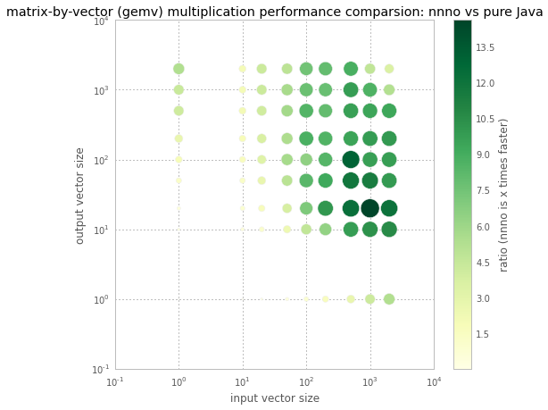
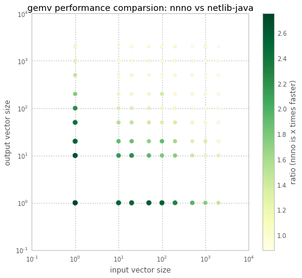
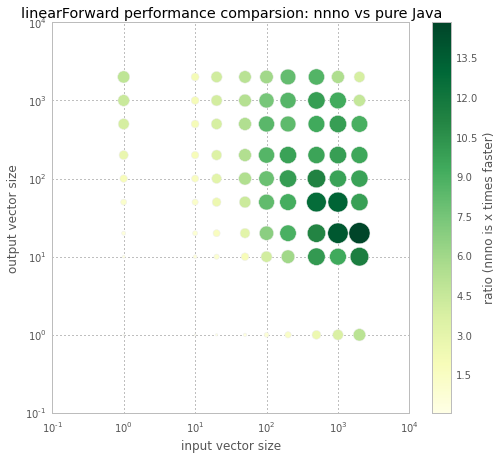

# neural-network native operations

Small Java lib with few neural-network operations:
 - ReLU
 - linearForward
 - and simple matrix-by-vector multiplication (gemv).

Behind the scenes it uses OpenBlas native library
hence it's even an order of magnitude faster than pure Java implementation.

It's also faster than [netlib-java](https://github.com/fommil/netlib-java) package.

Since full performance is achieved only with direct float buffers,
which are expensive to create, they must be reused.

## building the library

We supply a Maven artifact precompiled for Linux and sandybridge 64-bit processors
with the `SSE` and `AVX` instruction set on, but without `AVX2`.

To run on another processor / architecture one needs to follow the steps below:
 1. Get [OpenBLAS](https://github.com/xianyi/OpenBLAS)
 2. Compile it

    `make`

    (or `make USE_THREAD=0` if you don't want multithreading)
 3. and install **precisely** like this

    `make PREFIX=~/OpenBLASlib install`
 4. Finally go to neural-network-native-ops dir and

    `mvn clean compile exec:exec install`

    The `exec:exec` goal will execute `javacpp` postprocessing to
    generate C++ file and finaly `g++` compiler to produce JNI lib (`.so`).

## performance

Benchmarks were run on a desktop machine

```
$ cat /proc/cpuinfo
...
Intel(R) Core(TM) i5-4460  CPU @ 3.20GHz
model name	: Intel(R) Core(TM) i5-4460  CPU @ 3.20GHz
cpu MHz		: 3288.750
cache size	: 6144 KB
flags		: fpu vme de pse tsc msr pae mce cx8 apic sep mtrr pge mca cmov pat pse36 clflush dts acpi mmx fxsr sse sse2 ss ht tm pbe syscall nx pdpe1gb rdtscp lm constant_tsc arch_perfmon pebs bts rep_good nopl xtopology nonstop_tsc aperfmperf eagerfpu pni pclmulqdq dtes64 monitor ds_cpl vmx est tm2 ssse3 fma cx16 xtpr pdcm pcid sse4_1 sse4_2 x2apic movbe popcnt tsc_deadline_timer aes xsave avx f16c rdrand lahf_lm abm ida arat xsaveopt pln pts dtherm tpr_shadow vnmi flexpriority ept vpid fsgsbase tsc_adjust bmi1 avx2 smep bmi2 erms invpcid
bogomips	: 6400.01
```

#### gemv

Results below (table and graph) show performance ratio between native
and pure Java implementation of the matrix-by-vector multiplication (gemv)

input vector size|1|10|20|50|100|200|500|1000|2000
 ---|---|---|---|---|---|---|---|---|---
**output vector size**|||||||||||
1|0.1|0.1|0.2|0.5|0.9|1.7|2.8|4.2|5.3
10|0.3|0.6|1.1|2.4|4.7|6.4|9.8|10.4|10.7
20|0.5|0.9|1.8|3.8|7.2|10.1|12.3|14.6|12.2
50|1.3|1.3|2.7|5.0|8.3|9.3|11.9|11.5|9.9
100|1.9|1.7|3.3|5.7|6.5|8.5|13.1|9.7|9.8
200|2.8|1.9|3.7|5.5|8.8|8.7|9.5|9.9|10.0
500|4.2|2.1|4.1|5.9|8.6|8.0|9.7|9.4|9.3
1000|4.4|2.1|4.3|5.7|7.8|7.8|9.9|8.7|5.3
2000|5.4|2.1|4.3|4.9|7.5|8.0|8.9|4.8|3.6



It proves that using native code will repay when at least one dimension
is over 20. When both dimensions are between 50 and 1000, native
multiplication outperforms pure Java by an order of magnitude.
Best performance is observed when input vector is large and output vector is small.
Surprisingly, when both dimensions are over 1000, performance gain starts to diminish.


##### comparsion with netlib-java

nnno is faster than popular [netlib-java](https://github.com/fommil/netlib-java) package:
As you can se below, for dimensions up to 100 it is even twice as fast.

input vector size|1|10|20|50|100|200|500|1000|2000
 ---|---|---|---|---|---|---|---|---|---
**output vector size**|||||||||||
1|2.8|2.5|2.5|2.6|2.6|2.3|2.0|1.8|1.5
10|2.7|2.2|2.2|1.9|1.8|1.8|1.4|1.2|1.3
20|2.6|1.9|1.9|1.7|1.9|1.6|1.3|1.3|1.1
50|2.4|1.6|1.5|1.4|1.4|1.4|1.2|1.1|1.0
100|2.2|1.4|1.3|1.3|1.2|1.1|1.0|1.0|1.0
200|1.8|1.2|1.1|1.1|1.4|1.0|1.0|1.0|1.0
500|1.5|1.1|1.1|1.1|1.0|1.0|1.0|1.0|1.0
1000|1.3|1.0|1.0|1.0|1.0|1.0|1.0|1.0|1.0
2000|1.1|1.0|1.0|1.0|1.0|1.1|1.0|1.1|0.9




#### linearForward

Here are same ratios for linear forward operation:

input vector size|1|10|20|50|100|200|500|1000|2000
 ---|---|---|---|---|---|---|---|---|---
**output vector size**|||||||||
1|0.1|0.1|0.2|0.4|0.8|1.4|2.6|3.7|5.0
10|0.3|0.5|0.9|2.0|4.1|6.1|10.2|9.3|11.5
20|0.6|0.8|1.7|3.2|6.8|9.0|11.2|13.8|14.9
50|1.2|1.3|2.6|4.4|8.2|9.2|12.8|13.2|9.8
100|1.9|1.7|3.2|5.5|7.9|10.0|11.3|9.8|9.7
200|2.8|1.9|3.5|5.4|8.7|9.8|9.6|10.0|9.5
500|4.0|2.1|3.9|5.5|8.5|8.3|9.3|10.0|9.1
1000|4.5|2.1|4.0|5.3|7.5|8.6|9.9|9.3|4.7
2000|4.9|2.1|4.1|5.1|6.0|8.1|8.7|5.5|3.9




#### detailed benchmarks
Finally, some detailed benchmarks for preselected dimension 300x150.
You can see that using heap float buffers slows down native processing terribly.

```
# JMH 1.11.3 (released 42 days ago)
# VM version: JDK 1.8.0_45, VM 25.45-b02
# VM invoker: /opt/java/jdk1.8.0_45/jre/bin/java
# VM options: <none>
...
# Parameters: (inputSize = 300, outputSize = 150)
...
Benchmark                                (inputSize)  (outputSize)   Mode  Cnt         Score         Error  Units
NNNOBenchmark.pureJavaReLU                       300           150  thrpt    5  10322450,628 ±  575321,058  ops/s
NNNOBenchmark.nativeHeapReLU                     300           150  thrpt    5   2304726,292 ±  133278,375  ops/s
NNNOBenchmark.nativeDirectReLU                   300           150  thrpt    5  14078625,780 ± 2194065,899  ops/s

NNNOBenchmark.pureJavaGemv                       300           150  thrpt    5     24516,760 ±    3118,883  ops/s
NNNOBenchmark.nativeHeapGemv                     300           150  thrpt    5     29610,671 ±    3712,852  ops/s
NNNOBenchmark.nativeDirectGemv                   300           150  thrpt    5    295503,692 ±   30550,677  ops/s
NNNOBenchmark.netlibJavaGemv                     300           150  thrpt    5    280583,873 ±   16496,446  ops/s

NNNOBenchmark.pureJavaLinearForward              300           150  thrpt    5     24543,647 ±    1257,571  ops/s
NNNOBenchmark.nativeHeapLinearForward            300           150  thrpt    5     29064,199 ±    2509,292  ops/s
NNNOBenchmark.nativeDirectLinearForward          300           150  thrpt    5    302488,678 ±   26459,281  ops/s
```
#### run benchmarks

It takes more than 1h to run all benchmarks, hence they are turned off by default. To run them type
```
mvn test -P Benchmarks
```
## installation

Releases are distributed on Maven central:

```xml
<dependency>
    <groupId>com.rtbhouse.model</groupId>
    <artifactId>neural-network-native-ops</artifactId>
    <version>${nnno.version}</version>
</dependency>
```
